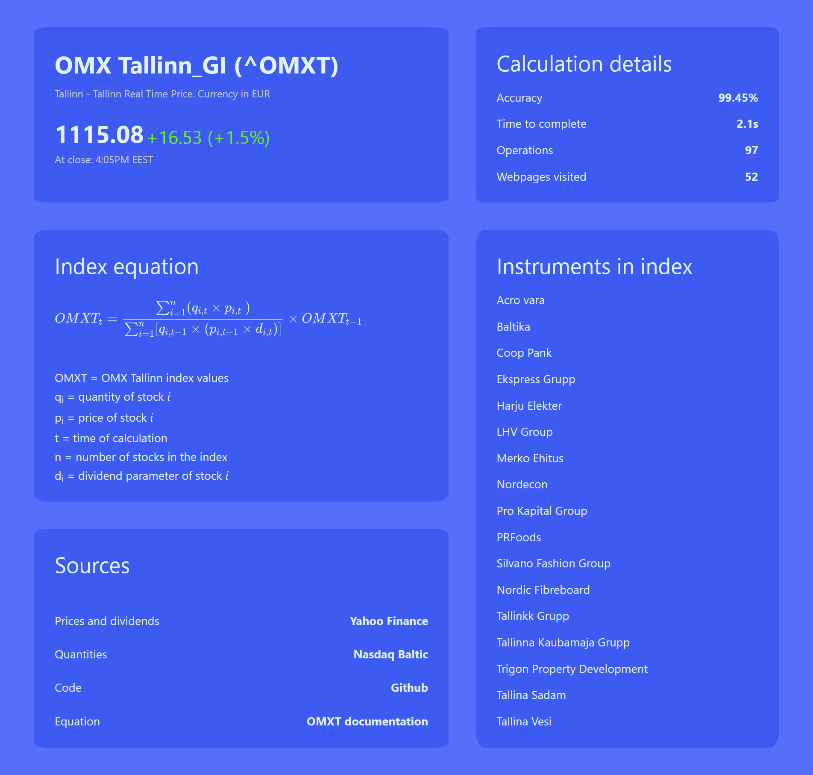

# OMX Tallinn_GI (^OMXT) Index Calculator

> A React web application that calculates the value of OMX Tallinn_G stock index using data that it scrapes from Yahoo Finance.

The OMX Tallinn_GI (^OMXT) is the main stock market index in Estonia. It reflects changes in the prices of shares listed in the Main and Investor lists of the Estonian Stock Exchange, and the Tallinn Stock Exchange. It uses the Paasche Index Formula. This React web application calculates the value of the index by gathering (fetching) and extracting data from Yahoo Finance and then applys it to the formula.

